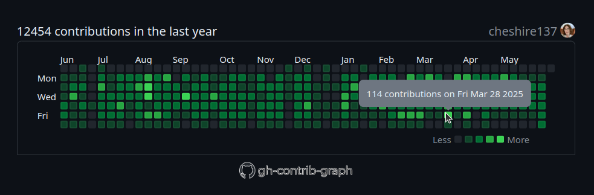

<div align="center">

<h3>archived</h3>
<p>
this repository is no longer maintained by its creator. the backend specified in the documentation has been disabled. i apologize for the inconvenience. thanks to those who participated in the development and to those who directly used it!
the graph itself (its static component) remains functional, provided the appropriate backend server is present.
</p>

</div>

---


---




## Usage

***All you need are three lines in your HTML file.***

```html
<!-- GOES INTO HEAD -->
<!-- lengthylyova.pythonanywhere.com deprecated since Friday 05 September 2025 -->
<!-- <link rel="stylesheet" href="http://lengthylyova.pythonanywhere.com/static/gh.css"> -->
<link rel="stylesheet" href="https://ghcg.lyova24.ru/static/gh.css">

<!-- GOES INTO BODY -->
<div id="gh" data-login="YOUR_GITHUB_LOGIN"></div>

<!-- GOES INTO THE END OF BODY -->
<!-- lengthylyova.pythonanywhere.com deprecated since Friday 05 September 2025 -->
<!-- <script src="http://lengthylyova.pythonanywhere.com/static/gh.js"></script> -->
<script src="https://ghcg.lyova24.ru/static/gh.js"></script>
```

* Replace `YOUR_GITHUB_LOGIN` with the *GitHub Login* of the user whose data you want to graph.

* [API Documentation](https://ghcg.lyova24.ru/schema#tag/ghcg)
